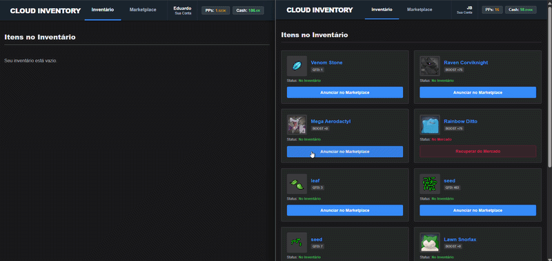

# Cloud Inventory - Central de Ativos Virtuais & Marketplace Backend

Este repositório contém a documentação técnica, decisões arquiteturais e especificações de engenharia do **Cloud Inventory**, um ecossistema backend desenvolvido na arquitetura Spring. A plataforma atua como uma central na nuvem para gerenciamento, custódia e reaproveitamento de itens e ativos virtuais de jogos, operando de forma integrada à base de dados legada do próprio servidor.

> **Nota de Privacidade:** O código-fonte deste projeto é mantido em um repositório privado por motivos de propriedade intelectual, segurança e conformidade com as regras de negócio do core do jogo. Esta documentação serve como vitrine técnica das capacidades arquiteturais implementadas.

---

## Tecnologias e Ecossistema
* **Linguagem Principal:** Java 8 (OpenJDK 8 - Temurin)
* **Framework Core:** Spring Boot 4 / Spring Data JPA
* **Segurança:** Spring Security (Customizado)
* **Banco de Dados:** MySQL (Integração com Sistema Legado TFS 0.3.6)
* **Comunicação e Protocolos:** HTTP/1.1 (HttpClient nativo), WebSockets (STOMP) e Webhooks

---

## Desafios de Engenharia & Soluções Implementadas

### 1. Compatibilidade de Segurança com Sistemas Legados
O banco de dados legado do jogo armazena as credenciais dos usuários utilizando criptografia antiga (SHA-1). Para não comprometer o fluxo de login em uma API Spring Boot moderna, estendi o ecossistema do Spring Security implementando um PasswordEncoder customizado (Sha1PasswordEncoder).
* **Solução:** O sistema intercepta as requisições via OncePerRequestFilter, valida os tokens JWT e autentica o jogador processando o hash SHA-1 de forma nativa e segura dentro do fluxo do Spring.

### 2. Controle Transacional Estrito e Consistência de Itens Virtuais
O Marketplace lida com a compra, venda e aluguel de itens virtuais utilizando tanto moedas digitais (pontos ou moedas do jogo) quanto dinheiro real. O maior desafio foi garantir a consistência das transações para evitar problemas de concorrência ou duplicação de itens (duping).
* **Solução:** Utilização de controle transacional isolado (@Transactional) no Spring Data JPA. O sistema valida a quantidade disponível no inventário do vendedor, realiza transações parciais e gerencia o agrupamento (stacking) de itens semelhantes no banco de dados. Se uma compra falhar ou os fundos forem insuficientes, a transação sofre rollback automático, mantendo o inventário dos jogadores intacto.

### 3. Integration Resiliente de Pagamentos (Mercado Pago API)
Implementei a integração completa com o gateway do Mercado Pago para permitir a compra de itens virtuais por transações financeiras reais via Pix de forma assíncrona.
* **Solução com Idempotência:** As requisições de cobrança são disparadas usando o java.net.http.HttpClient nativo do Java, injetando uma chave de idempotência (X-Idempotency-Key com UUID) no cabeçalho HTTP para impedir cobranças duplicadas em caso de instabilidade na rede.
* **Persistência de Cobranças Pendentes:** Caso o usuário feche a tela de checkout ou atualize a página antes de pagar, o estado da transação é retido no banco de dados. Um indicador visual de notificação é exibido na interface para alertar o jogador sobre transações Pix pendentes, permitindo que ele acesse o histórico e recupere o QR Code ativo para concluir o pagamento.

### 4. Entrega Automática e Eventos em Tempo Real via WebSockets
Por se tratar de ativos digitais, a entrega do item comprado deve ser imediata após a aprovação do pagamento, sem depender de atualizações manuais de página (HTTP Pooling).
* **Solução:** Configurei um broker de mensagens utilizando WebSockets (SimpMessagingTemplate). Assim que o Webhook do Mercado Pago confirma uma transação como aprovada, o service processa a transferência de propriedade do item no banco de dados e dispara imediatamente uma notificação para o canal exclusivo do jogador (/topic/payment/{id}), atualizando o inventário na interface instantaneamente.

### 5. Rotinas Agendadas para Resiliência do Sistema
Para evitar que itens virtuais fiquem reservados e travados indefinidamente por Pix que foram gerados e não pagos pelos jogadores, o sistema precisa de autonomia de limpeza.
* **Solução:** Implementação de um agendador automatizado (@Scheduled) executado em background a cada 60 segundos. A rotina varre o banco de dados em busca de cobranças pendentes que ultrapassaram o tempo limite, cancela a tentativa de pagamento e devolve o item automaticamente para o status de aberto no Marketplace, liberando-o para outros compradores.

---

## Principais Padrões de Projeto (Design Patterns) Aplicados
* **Data Transfer Object (DTO):** Isolamento completo da camada de controle e das entidades de banco de dados do jogo para segurança dos dados trafegados.
* **Service Layer:** Centralização estrita de todas as regras de negócio, validações de quantidade e lógica de transações fora dos Controllers.
* **Repository Pattern:** Abstração total do acesso ao banco de dados utilizando interfaces do Spring Data JPA.
